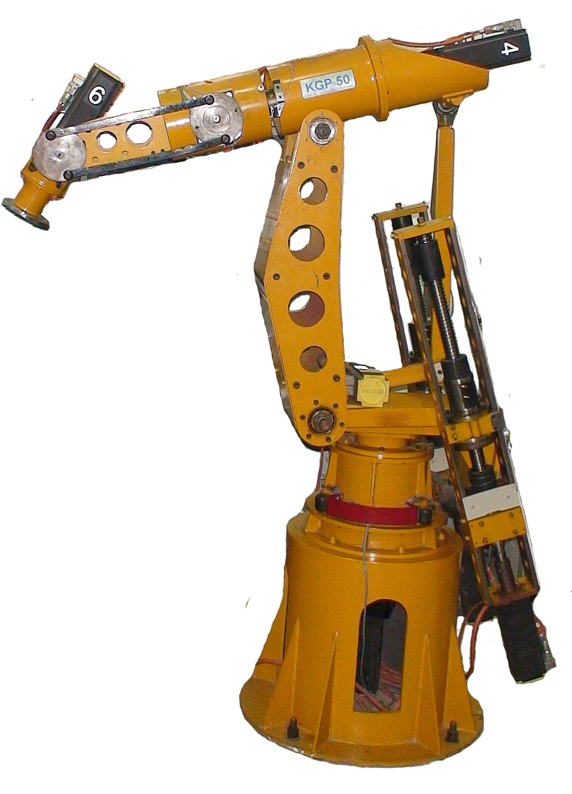
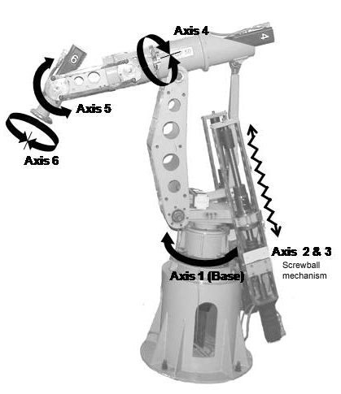
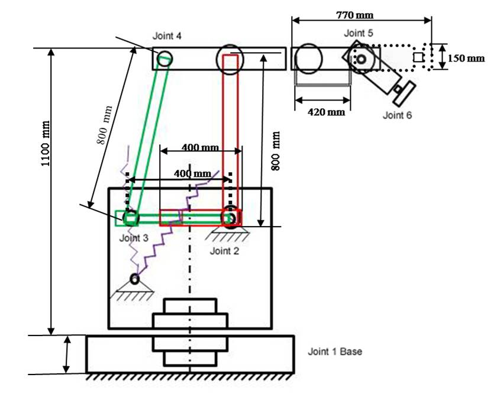
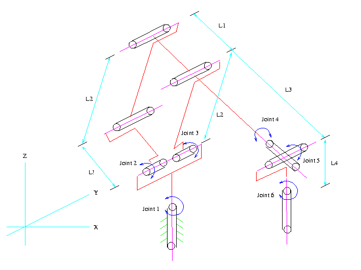
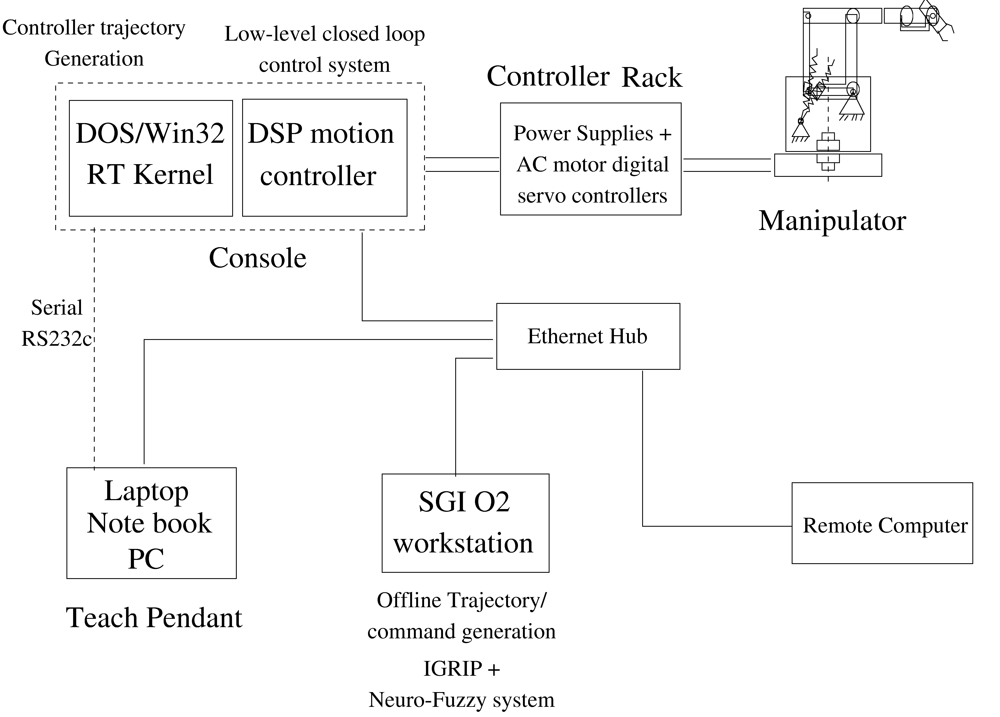

#  Introduction

The "KGP 50" is a state-of-the-art industrial prototype robot,positioned in the latest generation of industrial robot category. The product and technology, in its open architecture format, and the knowledge base from the IIT Kharagpur system, are strategic tools for any industries, educational institutions willing to promote or use them.

This robot can be made available for technology transfer and educational purposes. Currently, it is being used as a test bed for cutting edge technologies of human computer interaction and intelligent systems. Robotic technology, harnessed in the laboratory, has spawned and supported many growing areas of intelligent systems research. Prominent among these were the development of an intelligent driver vehicle interaction simulator. The system is a vehicle-driving simulator for a passenger car, where the driver's responses and automated vehicle control strategies under different driving conditions are generated and designs tested. A novel techniques of using fast learning neural networks for crisis management and control is being evolved on this test bed. It is expected to evolve a man machine collaborative learning system for intelligent systems in the new generation auto-mated vehicular systems.

Intelligent systems requiring complex human computer interaction, both in man machine systems and in complex knowledge based Internet environments, are being researched in this laboratory too. The future looks exciting, heading towards a new era of highly interconnected systems, devices and human life. The new prospects of research and development in this laboratory involve embedded systems, autonomous vehicles, etc.

***Figure 1: KGP 50***

##  Specification

# Industrial Robot KGP 50 Specifications and Characteristics

The following critical features have been incorporated in the design of the prototype. This is not a means of creating a one-off prototype, but more of a technology base for the entire commercial exploitation of a strategically important and state-of-the-art technology-intensive product.

## Specifications:

- 6-Axis, Continuous path control
- 50kg Payload
- 1.5m reach
- 1.5m/s maximum speed
- 1mm repeatability

## Characteristics:

- Full 6-Axis, Continuous servo implementation :

This robot is designed for industrial specification of all 6 axis motion specification with a considerable workspace for manipulation and dexterity. The axis are in continuous servo mode and fine positioning and velocity control for continuous paths can thus be easily achieved in industrial applications with this model. This feature is comparable to top of the line models in all international robot models.

- 3-Phase AC digital servo technology implemented and tested:

The robot is powered by the state-of-the art digital servo control of AC motors. The drive technology is the muscle of the robot, which drivers high torque even at a low speed maneuver operations, as well as rapid acceleration and decelerations required in high production rate manufacturing operations. The choice of technology has also been influenced by the international trend by which servo drive technology is moving towards model-based control and direct torque control. This technology is comparable and equals that of the top of the line industrial robot models used for a variety of high production rate processes and heavy-duty assembly line operations. The robot has its six degrees of freedom and motors synchronized and precision-controlled for coordinated motions using a real-time digital control station working on a Digital Signal Processing-based motion controller. The real-time operating system in the robot enables it to interact well with its environment

- DSP-based motion control implemented:

The skills of the robot are derived from the state-of-the-art motion control technology implemented in each of drivers and co-ordinate systems of the robot. A highly complex computational scheme in providing spline and continuous motion and trajectory interpolation in industry-desired co-ordinate frames has been adopted in the core design of the robot controller. This provides the computational capacity to operate the robot in the continuous path mode with extremely high repeatability and low error in all the six joint axis as well as cartesian or factory co-ordinate systems. It also provides the core for the extremely fast response of the robot to its own sensor systems as well as to interlock with other systems in any real application.

- Model for online and offline programming based on industry standard robotics software developed:

Robot of such complex order (six axis in continuous path mode) are extremely difficult to program by operators on the shop floor without a considerable technological training. In order to reduce the complexity of the training and operation phase in use, as well as make the system more usable by intuitive operators, the design incorporates a novel 3-D geometrical programming environment. This is based on industry standard CAD systems that provide an interface for easy operability and verification of the robot program. this unique feature can help in drastically reducing the operational costs related to operate training, downtime due to programming errors, rapid reprogramming of robot and testing of synchronization with any other robots or devices in real shop floor.

- Capability to fine-tune and implement motion control strategies incorporated in the design:

The robot has an open architecture heart built-in into the system, that enables robot developers to diagnose and improvise the design and/or performance of the robot, even after deployment. This is an important feature for technology developers that is not available to consumers of robot technology as technology adopters. The robot system has been specifically designed with this features, which is no available from any competitors (as it's the core technology of the system) and is very much required for a development industry as well as systems which can be adapted to any high-end applications

***Figure 2: KGP 50 rotation diagram***

#  Tutorial

- ### Workspace Envelope

    
- ### Math model

    
- ### Controller

- ## Forward Kinematics

The Forward kinematics equation can be computed as:    

$$ T_1^0 = \\begin{bmatrix} cos(\\theta_1) & -sin((\\theta_1)) & 0 & 0 \\\ sin(\\theta_1) & cos((\\theta_1)) & 0 & 0 \\\ 0 & 0 & 1 & 0 \\\ 0 & 0 & 0 & 1 \\end{bmatrix} \\quad  T_2^1 = \\begin{bmatrix} cos(\\theta_2) & -sin((\\theta_2)) & 0 & 0 \\\ 0 & 0 & 1 & 0 \\\ -sin(\\theta_2) & -cos((\\theta_2)) & 0 & 0 \\\ 0 & 0 & 0 & 1 \\end{bmatrix} $$

$$ T_3^2 = \\begin{bmatrix} cos(\\theta_3) & -sin((\\theta_3)) & 0 & l_1 \\\ sin(\\theta_3) & cos((\\theta_3)) & 0 & 0 \\\ 0 & 0 & 1 & 0 \\\ 0 & 0 & 0 & 1 \\end{bmatrix} \\quad  T_4^3 = \\begin{bmatrix} cos(\\theta_4) & -sin((\\theta_4)) & 0 & l_2 \\\ sin(\\theta_4) & cos((\\theta_4)) & 0 & 0 \\\ 0 & 0 & 1 & 0 \\\ 0 & 0 & 0 & 1 \\end{bmatrix} $$

$$ T_5^4 = \\begin{bmatrix} cos(\\theta_5) & -sin((\\theta_5)) & 0 & 0 \\\ sin(\\theta_5) & cos((\\theta_5)) & 0 & 0 \\\ 0 & 0 & 1 & 0 \\\ 0 & 0 & 0 & 1 \\end{bmatrix} \\quad  T_6^5 = \\begin{bmatrix} cos(\\theta_6) & -sin((\\theta_6)) & 0 & 0 \\\ 0 & 0 & -1 & 0 \\\ sin(\\theta_6) & cos((\\theta_6)) & 0 & 0 \\\ 0 & 0 & 0 & 1 \\end{bmatrix} $$

$$ T_0^6 = \\begin{bmatrix} R & P \\\ 0 & 1 \\end{bmatrix} T_6^0 = T_1^0 * T_2^1 * T_3^2 * T_4^3 * T_5^4 * T_6^5 $$

$$ p_x = cos(\\theta_1)(l_2 cos(\\theta_2) + l_3 cos(\\theta_2 + \\theta_3)) $$

$$ p_y = sin(\\theta_1)(l_2 cos(\\theta_2) + l_3 cos(\\theta_2 + \\theta_3)) $$

$$ p_z = -l_2 sin(\\theta_2) - l_3 sin(\\theta_2 + \\theta_3) $$

# Video

## KGP50 Industrial Robot

<video controls="" muted="" autoplay="" width="420" height="340"><source src="./images/kgp50robot_2.mp4" type="video/mp4"></video>

